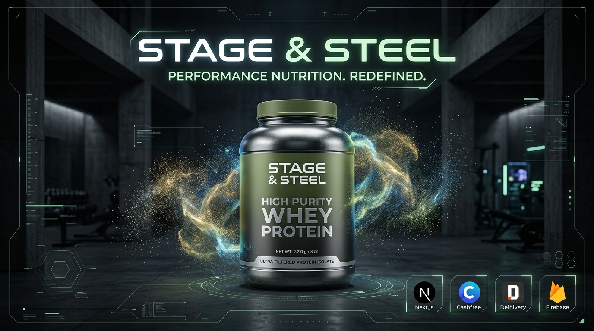
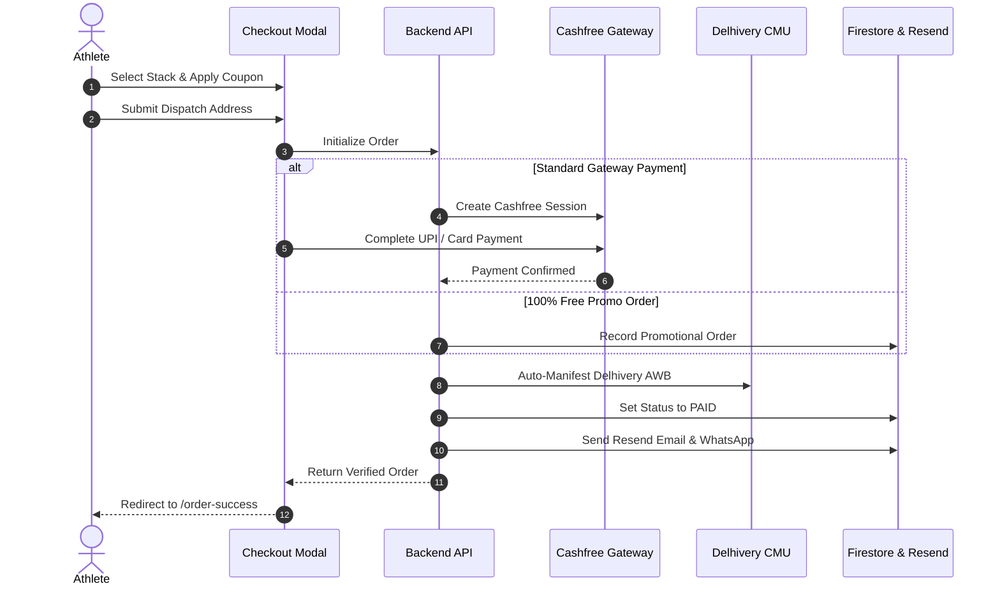

<div align="center">

# ⚡ STAGE & STEEL
### HIGH-PURITY PERFORMANCE NUTRITION // LUXURY D2C E-COMMERCE



[](https://nextjs.org/)
[](https://www.typescriptlang.org/)
[](https://tailwindcss.com/)
[](https://deepmind.google/)
[](https://www.cashfree.com/)
[](https://www.delhivery.com/)
[](https://firebase.google.com/)

<br />

**Architected & Built by [Jay Gupta (@jaygupta-exe)](https://github.com/jaygupta-exe)**  
*Developed via next-gen **Vibe Coding** with **Google DeepMind Antigravity (AGY) AI***

</div>

---

## 📖 Overview

**Stage & Steel** is an enterprise-grade, high-performance Direct-to-Consumer (D2C) e-commerce platform crafted for high-purity sports nutrition. Built with **Next.js 16 (App Router + Turbopack)**, **TypeScript**, and **Editorial Brutalism aesthetics**, it combines tactile sensory feedback (3D interactive canvas physics, mechanical audio cues) with mission-critical fintech and supply chain integrations (**Cashfree PG**, **Delhivery Logistics**, **Firebase Cloud Firestore**, and **Resend Email API**).

The entire system was architected and built through **Vibe Coding** paired with **Google DeepMind Antigravity (AGY)**, showcasing human-AI collaborative software engineering at the highest standard.

---

## 🌟 Key Technical Highlights

### 🧪 1. 3D Powder Particle Canvas Physics
- Custom high-performance HTML5 Canvas / WebGL particle simulation ([`PowderParticleCanvas.tsx`](components/PowderParticleCanvas.tsx)).
- 60 FPS interactive collision dynamics responsive to cursor magnetism, velocity, and scroll events to simulate raw protein powder in motion.

### 🔊 2. Sensory Mechanical Sound FX Engine
- Web Audio synthesizer & mechanical sound controller ([`lib/sound.ts`](lib/sound.ts)).
- Real-time tactile feedback on add-to-cart clicks, drawer transitions, and checkout confirmation.

### 💳 3. Cashfree Live Payment Pipeline
- Full Cashfree Web SDK v3 modal integration ([`components/CheckoutModal.tsx`](components/CheckoutModal.tsx)).
- Automated server-side order generation ([`/api/cashfree/create-order`](app/api/cashfree/create-order/route.ts)) with SHA-256 signature verification, idempotent webhook handling, and real-time polling fallback.

### 🚚 4. Delhivery CMU B2C Logistics Automation
- Real-time PIN code express serviceability validation ([`/api/delhivery/check-pincode`](app/api/delhivery/check-pincode/route.ts)).
- Automated CMU shipment creation and Air Waybill (AWB) generation upon payment capture ([`lib/orderFulfillment.ts`](lib/orderFulfillment.ts)).
- Direct one-click package tracking URLs for customers.

### 🎟️ 5. Dynamic Coupon & Referral Engine
- Scalable promo code engine ([`lib/coupons.ts`](lib/coupons.ts)) supporting:
  - Percentage discounts (`% OFF`) with configurable max discount caps.
  - Flat amount discounts (`₹ OFF`) with minimum cart value validation.
  - Gateway testing coupons (`TEST1`, `RUPEE1`) locking payable amount to ₹1.
  - **100% Free Promotional Orders (`₹0`)** bypass with direct Delhivery dispatch ([`/api/orders/create-free-order`](app/api/orders/create-free-order/route.ts)).

### 🛡️ 6. Firebase Firestore & Full Admin Dashboard
- **Admin Suite** ([`app/admin/`](app/admin/)): Real-time orders monitor, product inventory CMS, and dynamic coupon management.
- Multi-tier authentication with Firebase Auth (Google One-Tap + Email/Password + Role-based Admin Guard).

### 📬 7. Omnichannel Customer Communication
- High-deliverability transactional order receipt emails powered by **Resend API**.
- Deep-linked instant **WhatsApp Order Notification** for direct customer dispatch updates.

---

## 🏗️ Architecture & Order Lifecycle Flow



---

## 📂 Project Structure

```bash
stageandsteel/
├── app/                           # Next.js 16 App Router Pages & APIs
│   ├── admin/                     # Secured Admin Portal
│   │   ├── coupons/               # Promotional Voucher Engine
│   │   ├── orders/                # Live Order Fulfillment & Tracking
│   │   └── products/              # Inventory & Stack CMS
│   ├── api/                       # High-performance Backend Endpoints
│   │   ├── cashfree/              # Create Order, Verify, Return & Webhook
│   │   ├── delhivery/             # Pincode Check & AWB Shipment Manifest
│   │   └── orders/                # Free Promotional Order Fulfillment
│   ├── order-success/             # Post-Payment Order Confirmation & Tracking
│   └── page.tsx                   # Main Landing Page & Interactive 3D Showcase
├── components/                    # Reusable UI & Sensory Components
│   ├── AuthModal.tsx              # Google & Email Authentication Modal
│   ├── CheckoutModal.tsx          # Multi-step Checkout & Payment Drawer
│   ├── PowderParticleCanvas.tsx   # Interactive 60 FPS Particle Canvas
│   └── PowderMegaMenu.tsx         # Tactile Navigation & Sound Integrations
├── context/                       # Global React Context Providers
│   ├── AuthContext.tsx            # Firebase Auth State
│   └── CartContext.tsx            # Cart & Dynamic Coupon Computation
├── lib/                           # Core Business Logic & SDKs
│   ├── coupons.ts                 # Dynamic Coupon Calculation & Validation
│   ├── firebase.ts                # Firestore & Auth SDK Client
│   ├── orderFulfillment.ts        # Delhivery Manifest & Resend Email Pipelines
│   └── sound.ts                   # Mechanical Audio & Web Audio Synthesizer
└── public/                        # Static Assets, Textures & 3D Cutouts
```

---

## 🛠️ Tech Stack & Integrations

| Layer | Technologies |
| :--- | :--- |
| **Frontend Framework** | **Next.js 16 (Turbopack)**, React 19, TypeScript |
| **Styling & Design System** | Tailwind CSS, Lucide Icons, Custom Editorial Typography |
| **Interactive Sensory** | HTML5 Canvas Particle Engine, Web Audio API |
| **Payment Gateway** | **Cashfree Payments API** (v2023-08-01 Web SDK) |
| **Logistics & Courier** | **Delhivery CMU API** (Automated Surface & Express Dispatch) |
| **Database & Auth** | **Firebase Cloud Firestore**, Firebase Authentication |
| **Transactional Email** | **Resend Email API** with custom dark-mode HTML templates |
| **AI Pair Programming** | **Google DeepMind Antigravity (AGY)** |

---

## 🚀 Getting Started

### 1. Clone the Repository
```bash
git clone https://github.com/jaygupta-exe/stageandsteel.git
cd stageandsteel
```

### 2. Install Dependencies
```bash
npm install
```

### 3. Configure Environment Variables
Create a `.env.local` file in the root directory:
```env
# Firebase Web App Configuration
NEXT_PUBLIC_FIREBASE_API_KEY=your_api_key
NEXT_PUBLIC_FIREBASE_AUTH_DOMAIN=your_project.firebaseapp.com
NEXT_PUBLIC_FIREBASE_PROJECT_ID=your_project_id
NEXT_PUBLIC_FIREBASE_STORAGE_BUCKET=your_storage_bucket
NEXT_PUBLIC_FIREBASE_MESSAGING_SENDER_ID=your_sender_id
NEXT_PUBLIC_FIREBASE_APP_ID=your_app_id

# Cashfree Payment Gateway Credentials
CASHFREE_APP_ID=your_cashfree_app_id
CASHFREE_SECRET_KEY=your_cashfree_secret_key
CASHFREE_ENVIRONMENT=PRODUCTION # or SANDBOX

# Delhivery B2C Logistics Credentials
DELHIVERY_API_TOKEN=your_delhivery_api_token
DELHIVERY_CLIENT_NAME=your_client_name
DELHIVERY_ENVIRONMENT=PRODUCTION

# Resend Transactional Email API
RESEND_API_KEY=your_resend_api_key
RESEND_FROM_EMAIL=orders@yourdomain.com
```

### 4. Run Development Server
```bash
npm run dev
```
Open [http://localhost:3000](http://localhost:3000) to view the live interface.

### 5. Build for Production
```bash
npm run build
npm run start
```

---

## 👨‍💻 Author & Credits

- **Developer & Creator:** [Jay Gupta](https://github.com/jaygupta-exe)
- **Concept:** Luxury Performance Nutrition E-Commerce
- **AI Pair Programmer:** [Google DeepMind Antigravity (AGY)](https://deepmind.google/)
- **Methodology:** High-Velocity Vibe Coding & Precision Engineering

---

<div align="center">
  <sub>Engineered with precision for Stage & Steel. Built by <a href="https://github.com/jaygupta-exe">@jaygupta-exe</a> with Google Antigravity.</sub>
</div>
